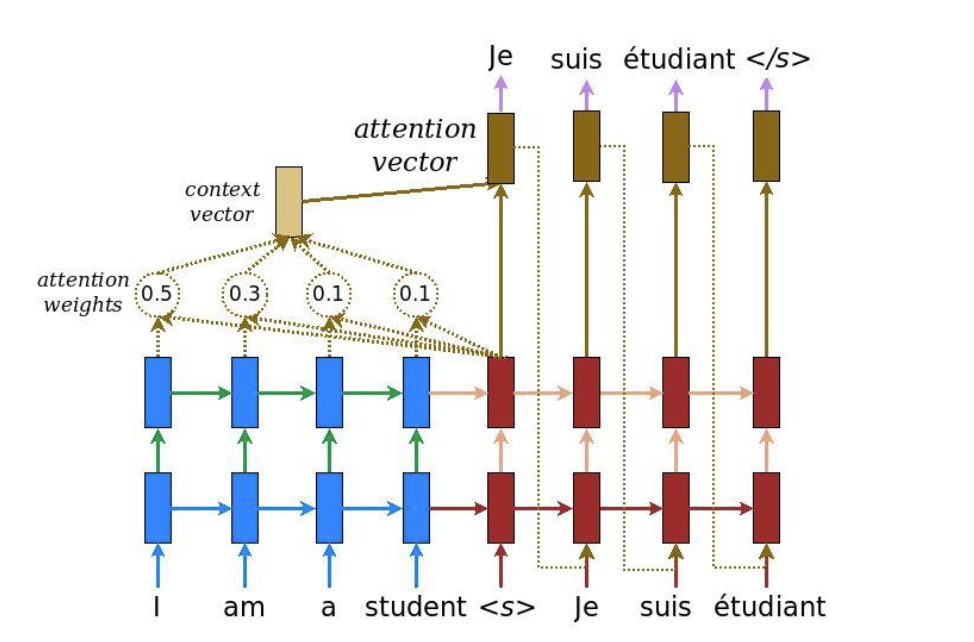
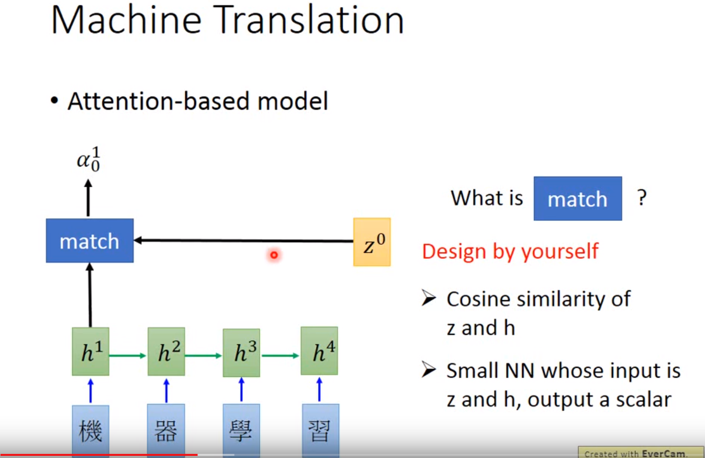
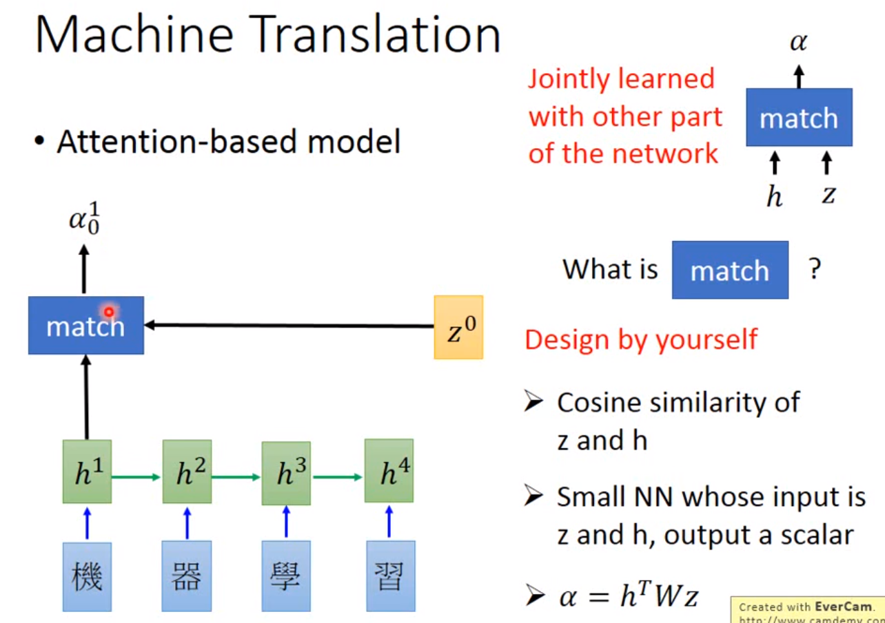
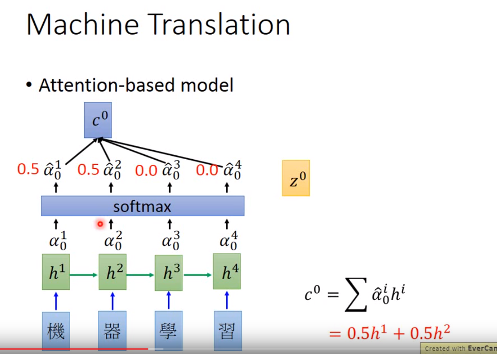
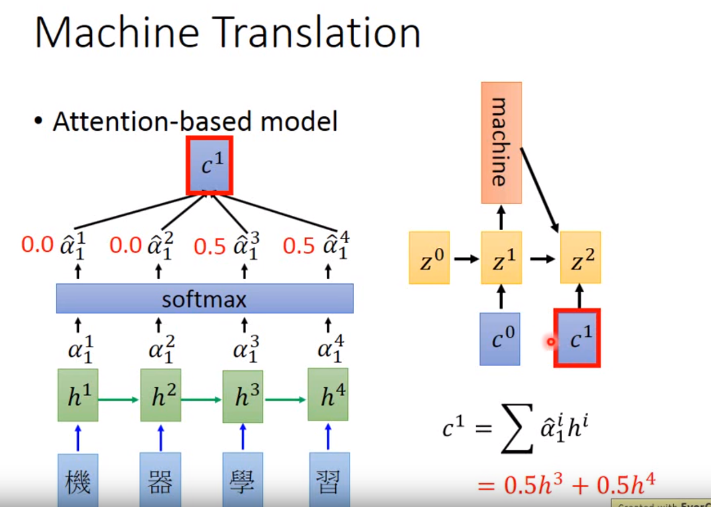
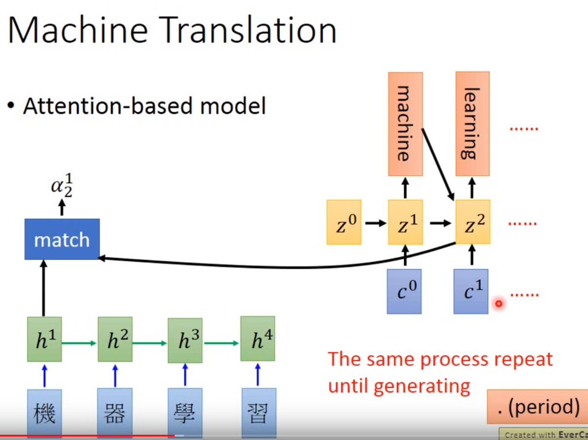

## 学习笔记
### 常规任务：
了解 seq2seq attention greedy-search beam-search 等原理，
了解代码实现细节并和paper公式进行对比，能够画图讲解原理过程，能够写出公式讲解
各部分运算过程（基本完成）。  
[google-nmt](https://github.com/tensorflow/nmt)
  

[hongyiLee-seq2seq](https://www.youtube.com/watch?v=f1KUUz7v8g4)

### 进阶任务
接下来可以尝试修改代码用于 [en-text-normolization](https://www.kaggle.com/c/text-normalization-challenge-english-language/leaderboard) 看看效果如何
根据效果和 badcase 进行进一步的改进，从而在该方向上有更加深入的积累，这个问题还需要用到
序列标注来配合。
